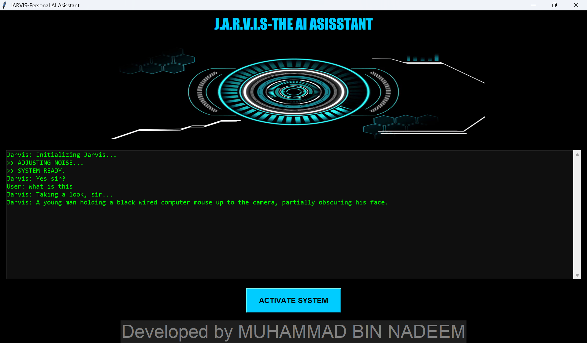
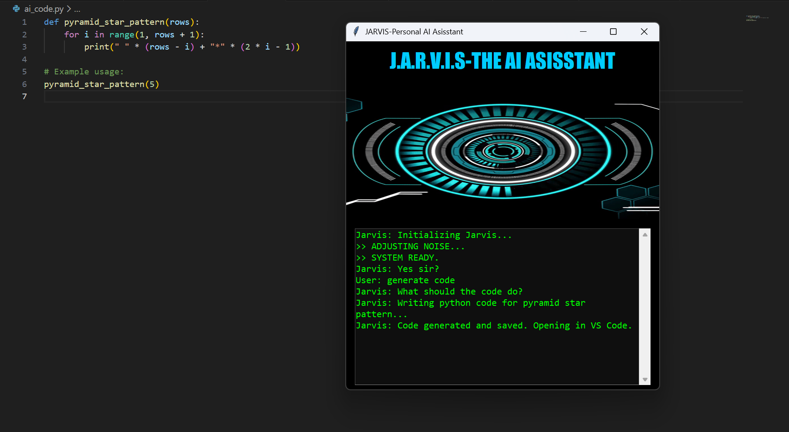

# JARVIS - Next-Gen AI Assistant 🤖
### Powered by Google Gemini 3 Flash (Preview) & Python


## 🚀 Overview
JARVIS is a futuristic **Desktop AI Assistant** that pushes the boundaries of Multimodal AI. Built for the **Gemini Global Hackathon**, this project leverages the **cutting-edge Gemini 3 Flash Preview model** to See, Hear, Reason, and Automate tasks with unprecedented speed and accuracy.

Unlike traditional assistants, Jarvis doesn't just chat—it **acts** on your behalf by understanding your screen, real-world objects, and coding needs.

## 🧠 Why Gemini 3 Flash?
This project is built on Google's latest **`gemini-3-flash-preview`** architecture, demonstrating next-level capabilities:

1.  **Ultra-Fast Reasoning:** Utilizing the Flash model's low latency for real-time decision-making and study planning.
2.  **Advanced Vision (Multimodal):** Analyzes complex visual data (handwriting, screens, objects) faster than previous generations.
3.  **Contextual Intelligence:** Understands system health (CPU/Battery) and user intent to provide proactive, human-like advice.

## ✨ Key Features

### 👁️ Next-Gen Vision (Gemini 3 Vision)
- **Screen Intelligence:** Command *"Explain my screen"* takes a snapshot, and Gemini 3 analyzes code errors, graphs, or articles instantly.
- **Real-World Analysis:** Identifies objects, rates outfits ("Fashion Advisor"), and digitizes handwritten notes into text files.
- **Health Coach:** estimates calories and nutritional info from food photos.

### 💻 System Automation & Control
- **AI Code Writer:** Dictate logic, and Jarvis generates clean Python code, saves it, and launches VS Code automatically.
- **Media Control:** Touch-free control using Hand Gestures (OpenCV & MediaPipe integration).
- **Desktop Management:** Voice-controlled app switching, window management, and system locking.

### 🗣️ Seamless Interaction
- **Continuous Chat Mode:** Engage in fluid, back-and-forth conversations without repeated wake words.
- **Personality Engine:** Features a "Roast Me" mode where the AI analyzes your appearance/environment for a witty response.

## 🛠️ Tech Stack
- **AI Core:** **Google Gemini 3 Flash Preview (`gemini-3-flash-preview`)**
- **Language:** Python 3.x
- **Computer Vision:** OpenCV, MediaPipe
- **Voice Stack:** SpeechRecognition, Pyttsx3
- **Automation:** PyAutoGUI, OS, Subprocess
- **GUI:** Custom Tkinter Dashboard

## ⚙️ Installation & Setup

To run this project on your local machine, follow these simple steps:

1.  **Clone the Repository**
    ```bash
    git clone [https://github.com/YourUsername/Jarvis-Gemini-AI-Assistant.git](https://github.com/YourUsername/Jarvis-Gemini-AI-Assistant.git)
    cd Jarvis-Gemini-AI-Assistant
    ```

2.  **Install Dependencies**
    I have listed all necessary AI and System libraries in `requirements.txt`.
    ```bash
    pip install -r requirements.txt
    ```

3.  **Add API Key**
    - Get your **FREE API Key** from [Google AI Studio](https://aistudio.google.com/).
    - Open `main.py` in your code editor.
    - Locate the line: `GEMINI_API_KEY = "YOUR_GEMINI_API_KEY_HERE"`
    - Paste your actual key inside the quotes.

4.  **Run the Assistant**
    ```bash
    python main.py
    ```
    *Note: Ensure your webcam and microphone are connected.*

## 📸 Screenshots

| **Vision Analysis (Seeing)** | **AI Code Generation (Thinking)** |
|:---:|:---:|
|  |  |


## 🔮 Future Roadmap

We plan to push the capabilities of JARVIS even further using the evolving Gemini ecosystem:

* **Gemini Live API Integration:** Transition from "Snapshot Vision" to **Real-time Video Analysis** (Latency < 500ms).
* **IoT Smart Home Control:** Connecting Jarvis to control lights, fans, and thermostats using Raspberry Pi.
* **Long Context Memory:** Using Gemini's 1M+ token window to allow Jarvis to remember conversations from weeks ago.
* **Voice Cloning:** Integrating custom voice models to make Jarvis sound exactly like the movie version.